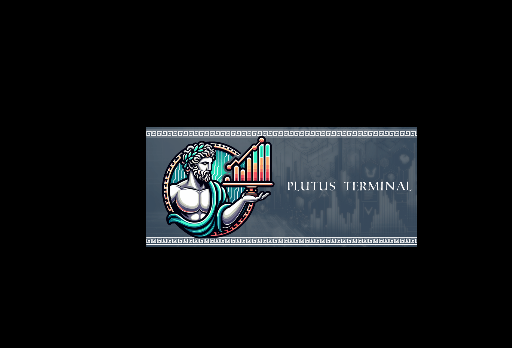
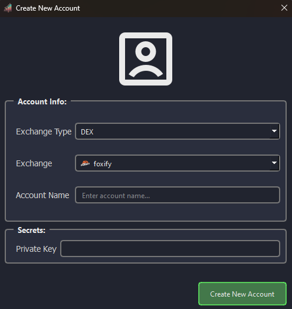
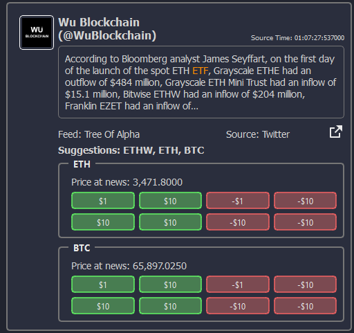
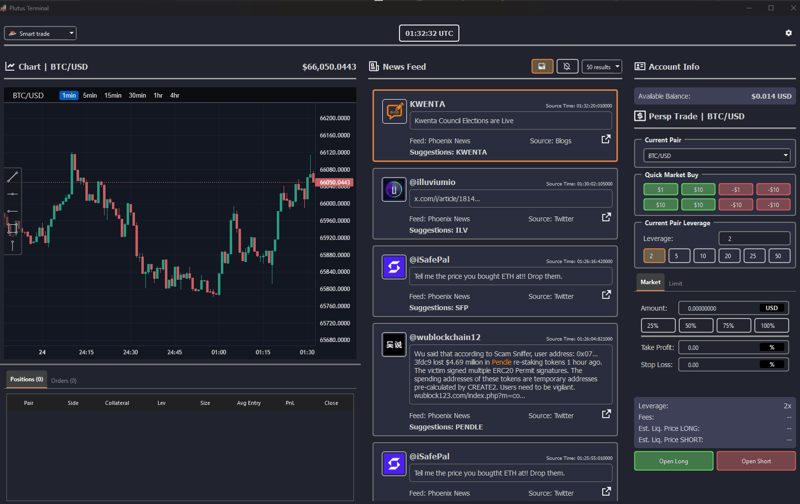
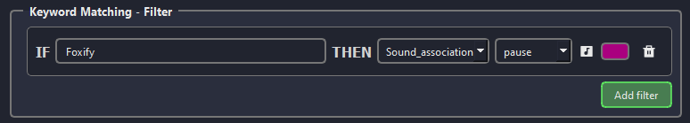
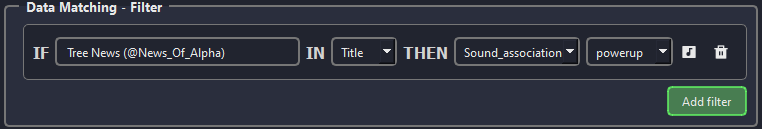

<div align="center">


[](https://plutuss-organization.gitbook.io/documentation/)


# Plutus Terminal
</div>

## What is Plutus Terminal? 🌟

<p align="center">
    
</p>

Plutus Terminal is a powerful **open-source** crypto news trading terminal
focused on Perpetuals DEX. Designed to be user-friendly, it allows you to trade
using real-time news updates, control positions, and manage multiple DEXs.

Embracing the web3 mentality, Plutus Terminal ensures you are always in control
of your keys, handles everything locally, and interacts directly with the DEX
contracts.

## Features 🎯

- 💻 Runs locally on your computer
- 🌐 Cross-platform (Windows, Linux, MacOS)
- 🔄 Integrates TreeOfAlpha and PhoenixNews
- 🛠️ Highly customizable news filters
- 🔔 Never miss news with desktop notifications
- 💎 Open-source and free
- 🌍 Use your own RPC nodes

## ⚠️  Disclaimer

Plutus Terminal is in **alpha** version and it's more likely to break. It
trades on the Perpetuals DEX using real money. Do not risk money you cannot
afford to lose.

**PLUTUS TERMINAL IS PROVIDED "AS IS". USE THE SOFTWARE AT YOUR OWN RISK**. The
authors and all affiliates assume no responsibility for your trading results or
any other consequences arising from the use of this tool. The entire risk as to
the quality and performance of the program is with you. Should the program
prove defective, you assume the cost of all necessary servicing, repair, or
correction.

By using Plutus Terminal, you acknowledge and agree that:

* You understand the risks involved in trading cryptocurrencies.
* You will not hold the authors or affiliates liable for any financial losses, data breaches, or other damages.
* You have read and understood the source code before using the tool.
* Positions opened with Plutus Terminal will automatically use our referral codes when possible.

Plutus Terminal is for educational and informational purposes only and does not constitute financial advice.

## 🛠️  Installation

Plutus Terminal is a Python package with multiple dependencies. You can install
it by downloading the PyApp executable, using pipx, or building it with Poetry.

> [!WARNING]
> The following instructions will show how to install Plutus Terminal unstable version!
> Unstable version is more likely to break.

<details>
<summary>
<strong>Installation using <code>PyApp executable</code>:</strong>
</summary>

### PyApp

#### To install

Download the plutus-terminal executable from the [Releases page](https://github.com/plutus-terminal/plutus-terminal/releases) and run it directly.

#### To update

From the terminal run:

```bash
<plutus_terminal_executable> self update
```

#### To uninstall

```bash
<plutus_terminal_executable> self remove
```

> [!NOTE]
> To learn more about PyApp, check out the [PyApp documentation](https://ofek.dev/pyapp/latest/)

<br>
</details>
<br>

<details>
<summary>
<strong>Installation using <code>pipx</code>:</strong>
</summary>

<br>

### Pipx

#### To install

```bash
pipx install git+https://github.com/plutus-terminal/plutus-terminal.git@unstable
```

Run with:

```bash
plutus-terminal
```

#### To update

```bash
pipx upgrade plutus-terminal
```

</details>
<br>

<details>
<summary>
<strong>Installation using <code>Poetry</code>:</strong>
</summary>
<br>

### Poetry

#### To install

First, clone the repository:

```bash
git clone https://github.com/plutus-terminal/plutus-terminal.git
```

Navigate to the cloned repository:

```bash
cd plutus-terminal
```

Checkout the `unstable` branch:

```bash
git checkout unstable
```

Then, install the package:

```bash
poetry install
```

Run the tool with:

```bash
poetry run plutus-terminal
```
#### To update

```bash
git pull
poetry update
```

</details>

## 🚀 Quick Start

Bellow you will find a simple guide on how to get started with Plutus Terminal.
For a more complete documentation please refer to the
[documentation](https://plutuss-organization.gitbook.io/documentation)

### Create new account

When opening the terminal the first time, you will be prompted to create an account.
<details>
<summary>
See image...
</summary>
<div align="center">

</div>
<br>
> [!NOTE]
> The same private key can be used to create multiple accounts on different
> exchanges.
</details>
<br>

Fill the form with the required information and press `Create New Account`.

> [!CAUTION]
> The private key will be stored in the OS keyring, always ensure
> your OS is secure.

### News quick market buy

Once the account is created you should see the terminal opening after a couple
of seconds.

News will be presented in real-time under the `News Feed` widget, if the coins
associated with the news are available on the selected exchange you will see a
quick trade group appear on the news.

<details>
<summary>
See image...
</summary>
<br>
<div align="center">

</div>
</details>
<br>

> [!NOTE]
> `Quick Market Buy` values represent the amount of capital that will be used
> to open your position. This value get's multiplied by the current pair
> leverage to determine the size of the position.

### Auto TP/SL

Quick Market buys can be configured with `TP` and `SL` values. For that you
will need to open the configuration window by pressing the gear icon on the top
right corner.

Once the window is open, you can set the `TP` and `SL` values on the `Trade` tab.

<details>
<summary>
See image...
</summary>
<br>
<div align="center">

</div>
</details>
<br>

> [!NOTE]
> Each account have their own `TP` and `SL` values

### News Filters

You can configure the news filters by clicking on the `Filters` tab in the
configuration window.

There are 2 types of filters `Keyword Matching` and `Data Matching`. Both of
them allow actions to happen when the conditions are meet.

Posible actions are:

| Action            | Description                  |
| ----------------- | ---------------------------- |
| Sound Association | Play a specific sound        |
| Coin Association  | Associate a coin to the news |
| Ignore News       | Don't display the news       |

#### Keyword Matching

The `Keyword Matching` filter allows you to filter specific keywords in the
news body if the keyword is present the selected action will run on the news.

<details>
<summary>
Example
</summary>
<br>
<div align="center">

</div>
This filter will play the `pause` sound if the word `Foxify` is present in the
news body and it will color that word dark pink.
</details>


#### Data Matching

The `Data Matching` filter allows you to filter for word on specific data
fields if the word is present in the specified datafield then the selected
action will run on the news.

<details>
<summary>
Example
</summary>
<br>
<div align="center">

</div>
This filter will play the `powerup` sound if the title of the news is `Tree News (@News_Of_Alpha)`
</details>
<br>


> [!NOTE]
> Filters will only be saved if the `Save Filters` button is pressed and
> will only be applied after a restart.

#### Hotkey Shortcuts

| Hotkey             | Action                                                         |
| ------------------ | -------------------------------------------------------------  |
| `w`                | Move selected new 1 up                                         |
| `s`                | Move selected new 1 down                                       |
| `q`                | Move selected to the top                                       |
| `\`                | Open token modal search                                        |
| `Ctrl+j` or `UP`   | (Only on modal search) Move modal auto complete selection down |
| `Ctrl+k` or `DOWN` | (Only on modal search) Move modal auto complete selection down |


## 🌐 Exchanges

Current supported exchanges are:

*  [Foxify](https://perp.foxify.trade/#/trade/?ref=plutus_terminal)

Planned support:

*  [Foxify FUNDED](https://foxify-1.gitbook.io/foxify-funded-litepaper)
*  [GMX](https://app.gmx.io/#/trade/?ref=plutus_terminal)

## ❤️  Support

If this project was helpful, please consider supporting by:

* ⭐[Starring the project on GitHub](https://github.com/plutus-terminal/plutus-terminal)
* Use referral code `plutus_terminal`
* Make a donation:
    * EVM ADDRESS: 0x92E3E69597A81c9D8F131FD590E8028aD16d1155

Every bit helps. Thank you!

## 📜 License

Plutus Terminal is licensed under the `GNU General Public License version 3.0`

See [LICENSE](./LICENSE) for details.
